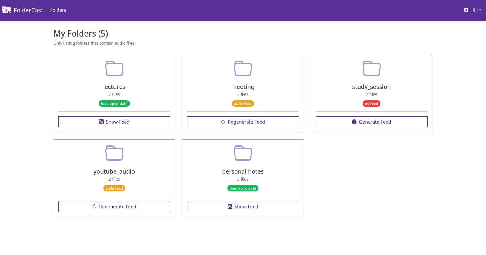
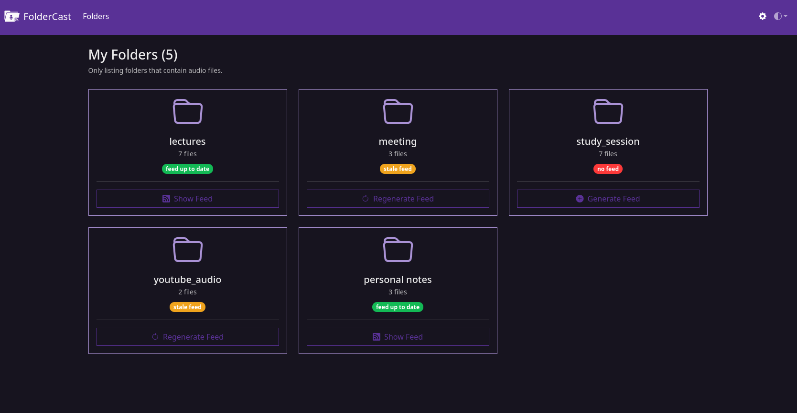
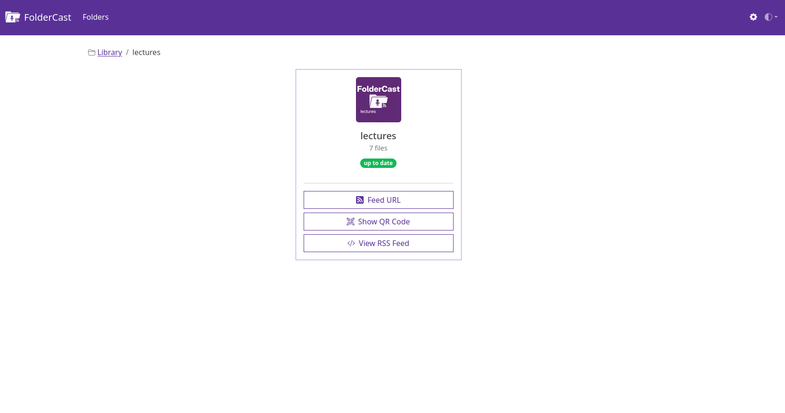
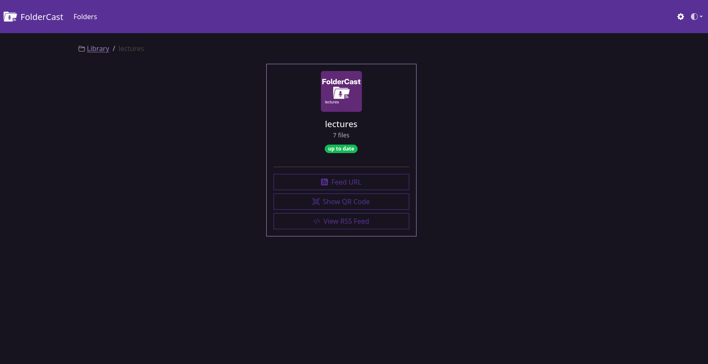

**FolderCast** is a self-hosted web app that generates podcast-ready RSS feeds from your local audio folders. It scans your chosen library directories, generates standard podcast feeds, and gives you a unique link (and QR code) for each one. Simply add that link to your favorite podcast player and stream your personal audio collection (lectures, YouTube downloads, audiobooks, or voice notes) just like a regular podcast. Everything runs locally and stays fully under your control.

---

### The Problem (What FolderCast Tries to Solve)

You probably have some or all of the following:

* YouTube videos converted to MP3s because you only care about the audio.
* Recorded or downloaded university lectures.
* Long personal voice notes.
* Any other long-form audio files.

You’d like to listen to these on the go (in the car, while walking, cooking, or doing chores).
Sure, you could copy them to your phone and use a regular audio player, but that quickly becomes a hassle. And once you do, you realize most music players aren’t built for long-form listening. They:

* Don’t remember your playback position.
* Have tiny scrubbers that make seeking in 2-hour files painful.
* Lack skip-forward/rewind controls.
* Don’t track which files you’ve finished.

So, maybe you try a podcast app instead: Perfect for long content, bookmarking, and smart playback, but now you face another problem: how do you get your personal audio files *into* your podcast player?

That’s where **FolderCast** comes in.

FolderCast automatically generates standard podcast RSS feeds for your audio folders. Each folder becomes its own podcast, and each audio file within it appears as an episode. You can manually subscribe to the feed in any podcast player (copy/paste feed URL, or simply scan its QR code with your phone). Your private “podcasts” appear right alongside your regular subscriptions, but they’re **hosted locally, accessible only from your own network**.

This gives you all the power of a modern podcast player, including:

* Organized playback with one feed per folder.
* Streaming or downloading episodes.
* Playback position tracking.
* Play, pause, rewind, skip, speed-up, silence trimming, and more.
* Visual indicators for listened/unlistened files.
* Automatic updates when new audio files are added to a folder.
* Optional automatic episode downloads.
* Syncing progress across devices (via tools like GPoddersync/Nextcloud).

That's what listening on a regular podcast player app gives you. But to get there, FolderCast offers you a set of features.

### FolderCast Features

* A single web interface for managing your entire local audio library.
* Organize files naturally into directories: one podcast feed per directory.
* Feeds follow standard podcast specifications and work with most podcast apps.
* Automatically generated artwork (thumbnail) for each feed, featuring the folder name.
* QR code generation for quick mobile subscriptions.
* Feed status indicators (Up to Date, Stale, No Feed).
* Smart feed generation: updates only when directories change.


### Screenshots





---

## Running FolderCast
FolderCast is available as a pre-built Docker image on GHCR, so there is no need to clone the repository or build the image locally. Follow the steps to run the project.

### 1. Create a working directory

```bash
mkdir foldercast
cd foldercast
```

### 2. Create your library directory

```bash
mkdir library
```

The `library` directory will contain subdirectories for your audio files. Each subdirectory inside `library` will be turned into an RSS feed.

### 3. Create `docker-compose.yml`

Create a file named `docker-compose.yml` inside the root of `foldercast` directory you created in step #1 and paste the contents of the project's [docker-compose.yml](https://github.com/ahmedlemine/foldercast/blob/main/docker-compose.yml) into it and save.

### 4. Update the configuration in `docker-compose.yml`

Before starting the container:

* Generate a new `SECRET_KEY` from https://djecrety.ir/
* Replace `<your_server_ip>` with your server's IP address or hostname.
* Change the host port (`8123`) if desired. If you do, update both `ports` and `SERVER_PORT` accordingly.
* Save `docker-compose.yml` file and close.

### 5. Start FolderCast

```bash
docker compose up -d
```

### 6. Open FolderCast Web UI

Visit:

```text
http://<your_server_ip>:8123
```

### Updating

To update to the latest version:

```bash
docker compose pull && docker compose up -d
```

---

### Contributing & Feedback

FolderCast is focused on doing one thing, and doing it well:
**turning your audio folders into podcast-ready RSS feeds.**

It’s not trying to be a media server, a cloud sync tool, or a file uploader.
Its goal is simplicity, reliability, and staying true to its purpose: generating clean, standard feeds for your audio collection.

If you find bugs, have suggestions that *directly improve that core purpose*, or want to share how you’re using FolderCast, contributions and feedback are very welcome.

You can:

* Open an issue or pull request on GitHub.
* Suggest refinements that make feed generation or local hosting better.
* Share ideas for improving usability without adding unnecessary complexity.


## Support FolderCast

If FolderCast has been useful to you, consider supporting its development. Your support helps cover build costs and gives me more time to improve the project, fix bugs, and add new features.

☕ Buy me a coffee: https://buymeacoffee.com/ahmedlemine

Thank you for your support!
